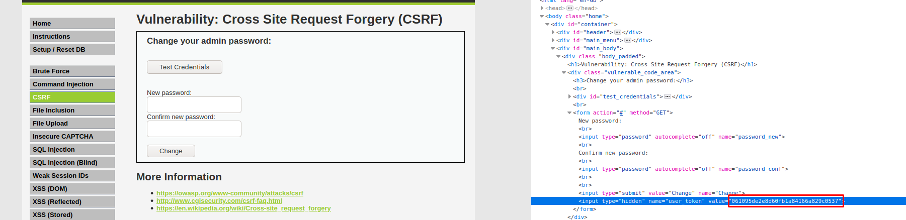
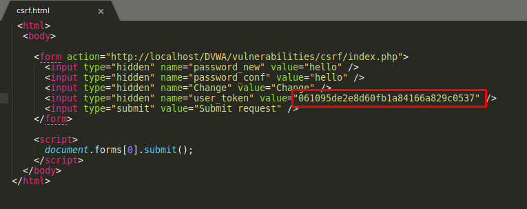
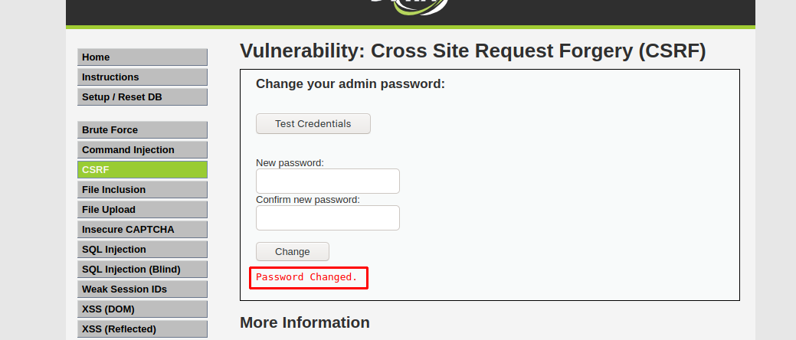

# Cross Site Request Forgery (CSRF/XSRF)

- *Attack that forces end user to perform unwanted actions on a web application in which they are currentky logged in/authenticated.*

---------------------------------------------------------------------------------------------------

**Vulnerable Code:** 

```
	 // Check Anti-CSRF token
    checkToken( $_REQUEST[ 'user_token' ], $_SESSION[ 'session_token' ], 'index.php' );

    // Get input
    $pass_new  = $_GET[ 'password_new' ];
    $pass_conf = $_GET[ 'password_conf' ];

    // Do the passwords match?
    if( $pass_new == $pass_conf ) {
        // They do!
        $pass_new = ((isset($GLOBALS["___mysqli_ston"]) && is_object($GLOBALS["___mysqli_ston"])) ? mysqli_real_escape_string($GLOBALS["___mysqli_ston"],  $pass_new ) : ((trigger_error("[MySQLConverterToo] Fix the mysql_escape_string() call! This code does not work.", E_USER_ERROR)) ? "" : ""));
        $pass_new = md5( $pass_new );

        // Update the database
        $insert = "UPDATE `users` SET password = '$pass_new' WHERE user = '" . dvwaCurrentUser() . "';";
        $result = mysqli_query($GLOBALS["___mysqli_ston"],  $insert ) or die( '<pre>' . ((is_object($GLOBALS["___mysqli_ston"])) ? mysqli_error($GLOBALS["___mysqli_ston"]) : (($___mysqli_res = mysqli_connect_error()) ? $___mysqli_res : false)) . '</pre>' );

        // Feedback for the user
        echo "<pre>Password Changed.</pre>";
    }
    else {
        // Issue with passwords matching
        echo "<pre>Passwords did not match.</pre>";
    } 
    
```
-------------------------------------------------------------------------------------------------

Here, it generates a random token which is hidden and verfies the change password request with the token.



- So, resend the plain request and grab a fresh token.
- Then, craft a malicious html and save the freshly grabed token in the html and host the html on a local server.



- As the end user visits the malicious crafted html, the password will be changed instantly.



----------------------------------------------------------------------------------------------------


