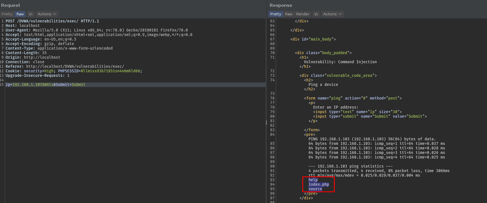

# Command Injection

- *Execution of arbitrary commands on the host operating system*
-----------------------------------------------------------------------------------------------------

**Vulnerable Code:**

```
    // Get input
    $target = trim($_REQUEST[ 'ip' ]);

    // Set blacklist
    $substitutions = array
    (
        '&'  => '',
        ';'  => '',
        '| ' => '',
        '-'  => '',
        '$'  => '',
        '('  => '',
        ')'  => '',
        '`'  => '',
        '||' => '',
    );

    // Remove any of the charactars in the array (blacklist).
    $target = str_replace( array_keys( $substitutions ), $substitutions, $target );
```
-----------------------------------------------------------------------------------------------------

As most of the delimeters are blacklisted, we can run more than one command via new line 

> **(\n, %0a)**

**Important Points:**

- Encoding/Decoding is used most importantly for data transfer and continuity, and also to understand special characters.
- Data travels from browser to server in the form of ASCII/UTF-8.
- Thus the space being the delimeter in the HTTP request, we can capture it in BurpSuite and run more than one command by *(%0a - new line)*



----------------------------------------------------------------------------------------------------

